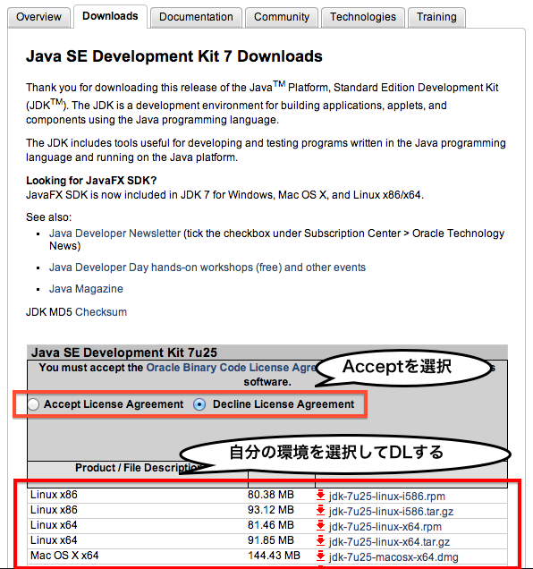

# インストール＆環境設定

この章では、Javaでサーバをたてるのに最低限必要なJDK, JRE, Tomcat, Eclipseをインストールし、環境設定するところまでをやります。

## JDKとJRE

JDK ( JRE付き ) をインストールします。

http://www.oracle.com/technetwork/java/javase/downloads/index.html

上のURLに移動して、 **Java Platform (JDK) 7u25** (7/22現在) をクリックします。以下のような画面に移動すると思います。

1. 上図に示すように、ライセンスに同意するかどうかのところの **Accept** にチェックを入れます。
2. その下から自分の環境を選択してダウンロードを開始してください。
	+ Windowsならexeファイル
	+ MacOSXならdmgファイル
3. ダウンロードしたものを実行するとインストールされます。（特に設定をいじる必要はありません）

このJDKの中に既にJREが入っているので、これでJDKとJREをインストールすることができました。

ちなみに、このJDK ( Java Development Kit ) とは、Javaでプログラムを作るために必要なKitで、JRE ( Java Runtime Environment ) とは、Javaで作られたプログラムを実行するのに必要なものです。

## Tomcat

Tomcatをインストールします。

http://tomcat.apache.org/

1. 上のURLに移動して、左のサイドメニューにある **Download > Tomcat 7.0** をクリックします。
2. 移動した先の **Quick Navigation > 7.0.42** (7/22現在)をクリックします。
3. 移動した先の **Binary Distributions > Core > zip** をクリックしてzipファイルをダウンロードします。
4. ダウンロードしたzipファイルを解凍して、任意の場所（あとで参照しやすい場所）に配置します。
	+ WindowsならCドライブ直下とか
	+ MacOSXならApplicationsやHomeの中とか

これでTomcatの準備は終わりです。

## Eclipse

ここからはEclipseの準備に入ります。

http://www.eclipse.org/downloads/

1. 上のURLに移動して、 **Package Solutions > Eclipse IDE for Java EE Developers** をダウンロードします。
2. ダウンロードしたものを解凍して任意の位置に配置します。（あとで参照しやすい場所をおすすめしますが基本どこでも良いです。）
 
ここでは日本語化については省略しています。日本語化に興味のある人は、下記URLからプラグインを落とせますので、後日やってみてください。

http://mergedoc.sourceforge.jp/

+ Windowsの場合、日本語化された（プラグインが内蔵された）Eclipseをダウンロードすることができます。
+ MacOSXの場合、プラグイン本体をダウンロードし、色々な設定をするとできます。  
参考サイト：MacのEclipseをPleiades化  
http://supportdoc.net/support-general/pleiades-mac.html）

## Eclipseの環境設定

ここではEclipseで以下の環境設定を行います。

1. まず、解凍したEclipseフォルダ内にある **eclipse** ファイルを実行してください。
2. workspaceをどこにするか聞かれるので任意の場所を指定してください。
3. Eclipseが起動したらメニューから環境設定（Preferences）を選択してください。
	+ Windowsの場合、 **Window > Preferences** 
	+ MacOSXの場合、 **Eclipse > 環境設定** 

この状態で、以下の３つの設定を行います。

### Tomcatの設定

1. 左側メニューから **Server > Runtime Environments** を選択
2.  **Add** ボタンをクリック
3. 開かれたダイアログで、 **Apache Tomcat v7.0** を選択し、Nextをクリック
4. **Tomcat installation directory** 項目の **Browse** から、落としてきたTomcatのフォルダを指定
5. **JRE** の項目が **Workbench default JRE** になっていることを確認
6. **Finish** をクリック

### Javaコンパイラの設定

1. 左側メニューから **Java > Compiler** を選択
2. **Compiler compliance level** の項目を1.7に変更する
3. **Apply** をクリック

### 行番号の表示

1. 左側メニューから **General > Editors > Text Editors** を選択
2. **Show line numbers** にチェックを入れる
3. **Apply** をクリック

ここまでで環境設定は終了です。お疲れ様でした。
いよいよ次からWebアプリケーションの概要に入ります。

---
ここまで行った環境設定は、今回のワークで動くことを目的としたものです。今後、様々なプラグインやフレームワークを入れていく場合は、それに適した環境設定に変更する必要がありますのでご注意ください。