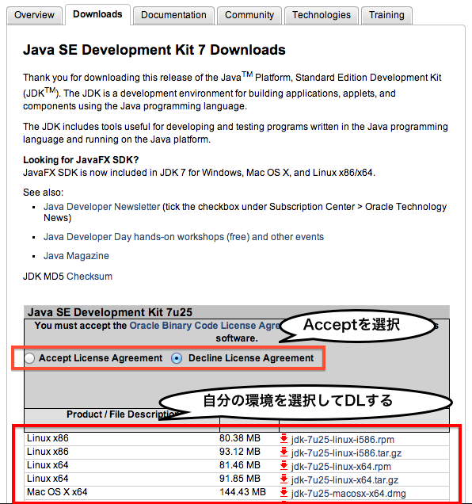

# インストール＆環境設定

この章では、Javaでサーバをたてるのに最低限必要なJDK, JRE, Tomcat, Eclipseをインストールし、環境設定するところまでをやります。

## JDKとJRE

JDK ( JRE付き ) をインストールします。

http://www.oracle.com/technetwork/java/javase/downloads/index.html

上のURLに移動して、```Java Platform (JDK) 7u25```(7/22現在) をクリックします。以下のような画面に移動すると思います。



1. ライセンスに同意するかどうかのところの```Accept```にチェックを入れます。
2. その下から自分の環境を選択してダウンロードを開始してください。
	+ Windowsならexeファイル
	+ Macならdmgファイル
3. ダウンロードしたものを実行するとインストールされます。（特に設定をいじる必要はありません）

このJDKの中に既にJREが入っているので、これでJDKとJREをインストールすることができました。

ちなみに、このJDK ( Java Development Kit ) とは、Javaでプログラムを作るために必要なKitで、JRE ( Java Runtime Environment ) とは、Javaで作られたプログラムを実行するのに必要なものです。


## Tomcat

Tomcatをインストールします。

http://tomcat.apache.org/

1. 上のURLに移動して、左のサイドメニューにある```Download > Tomcat 7.0```をクリックします。
2. 移動した先の```Quick Navigation > 7.0.42```(7/22現在)をクリックします。
3. 移動した先の```Binary Distributions > Core > zip```をクリックしてzipファイルをダウンロードします。
4. ダウンロードしたzipファイルを解凍して、任意の場所（あとで参照しやすい場所）に配置します。
	+ WindowsならCドライブ直下とか
	+ MacならApplicationsやHomeの中とか

これでTomcatの準備は終わりです。

## Eclipse

ここからはEclipseの準備に入ります。