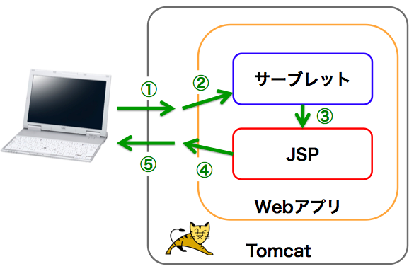

# Webアプリ（Javaの）の仕組み

実際の作業に入る前に、Javaで動作するWebアプリがどうやって動いているのかを
とっても簡単に説明します。（通常大事だと思われるところも省略しています）  
つい先日僕が勉強した内容をつらつらと書いているだけなので、
玄人の方々は、ここはすっ飛ばして作業に入ってください。

## 全体の構成

以下の図は、とっても簡単にJavaのWebアプリの構成を示します。  
注）実際のサービスでは、DBサーバなどの連携やフレームワークの導入などもっと複雑な構成になっています。

(上図①) クライアント（Webブラウザ）はサーバのURLにアクセスします。  
(上図②) サーバで常に起動しているTomcatが、URLにマッピングされているサーブレットを呼び出します。  
(上図③) 呼び出されたサーブレットでは、何らかの処理を行い、その処理結果をJSPに渡します。  
(上図④) JSPでは渡された処理結果を反映したHTMLを生成します。  
(上図⑤) 生成したHTMLをクライアントへ返し、HTMLを表示します。  

（ Tomcat？ サーブレット？？ JSP？？？ ）  
訳の分からない単語がたくさん出てきていますが、
それぞれについてはすぐあとに説明があるので、とりあえず今はこの図の構成をぼーっと眺めて、「あーこうなってるのねーふんふん」と分かった気になってください。

#####なんでこんな複雑な構造をしているのか
ただHTMLを表示するだけなのに、なんでこんなに複雑なことをしているのか。  
それはたいていのWebアプリでは、HTMLを動的に生成する必要があるからです。
例えば、ユーザのTwitterタイムラインを表示するWebアプリの場合、ユーザIDとパスワードから、各ユーザごとに異なるHTMLのページを生成しなければなりませんね。  
もし、どのページでも全ユーザに全く同じHTMLを見せればいいのなら、こうした枠組みはほとんど必要ないものになります。（これをWebアプリと呼んでいいのか）

ここから以降は、Tomcat、サーブレット、JSPの簡単な説明をして、最後にもう一度全体像を復習します。  
もう読み疲れた人はここを飛ばして、作業に入ってくれていいんだよ！（泣）

###Tomcat

Tomcat兄さんはサーバ上で常に起動しています。このTomcat兄さんは、サーブレットコンテナと呼ばれていて、クライアントからのリクエストを受け取って、実行すべきサーブレットのプログラムを探してきて、そのプログラムを実行します。  

###サーブレット

サーブレットは、「サーバ上で動作するJavaプログラム」という説明が一般的です。
なんともグッとこない説明ですが、ここで言いたいことは、「サーブレットはmainメソッドを持たない」ということです。  
一般のJavaプログラム（Applet）は必ずmainメソッドを持ち、プログラムを実行すると、まずmainメソッドを実行します。そして、そのmainメソッドの中で様々な関数を実行していく形をとります。  
それに対して、サーブレットにはmainメソッドがなく、サーブレット中に記述されたメソッドにはURLがマッピングされています。このURLにクライアントからアクセスがあると、アクセスを受け取ったTomcat兄さんが、マッピングされているサーブレットのメソッドを呼び出して実行することで、プログラムが実行されます。  
なので、一般的なJavaプログラムと違い、サーブレットは「サーバ上でTomcat兄さんにメソッドを指定されて動作するJavaプログラム」ということになります。

###JSP（JavaServer Pages）

JSPとは、動的にHTMLを生成することができる技術のことです。
JSPではHTML内にJavaのコードを埋め込んでおけるので、Javaプログラムの仕込まれたHTMLを直感的に書くことができます。最近ではサーブレットとセットに使われるのが一般的で、複雑な処理はサーブレット側に任せて、サーブレットから渡された情報をHTMLに反映するというのがJSPの主な役割になっています。  

###HTTPプロトコル

HTTPプロトコルとは、クライアント（ブラウザ）とサーバが行う通信のルールのことです。一般的なURLの先頭には「 **http://** 」をついているのをご存知だと思いますが、これはhttpプロトコルを用いて通信しますよーということを示しています。上の例で言うと、ブラウザからサーバにアクセスする部分、そしてサーバから結果を返す部分で、このプロトコルに則った通信を行っています。

---
Webアプリの仕組みのひじょーに簡単な解説は以上のようになります。
時間もありませんので、次から作業に入っていきましょう。

注）今回はとりあえず **簡単な** JavaのWebアプリを **短時間で** 作るということなので詳しくは扱いません。しかし、Webアプリを作るためにはこれらの知識は必要不可欠なので、後日時間のあるときに自習されることをオススメします。