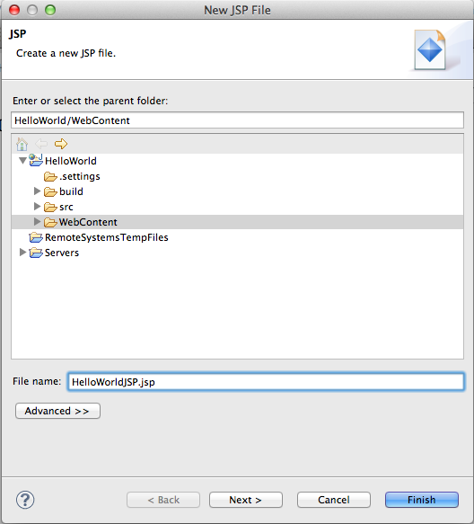
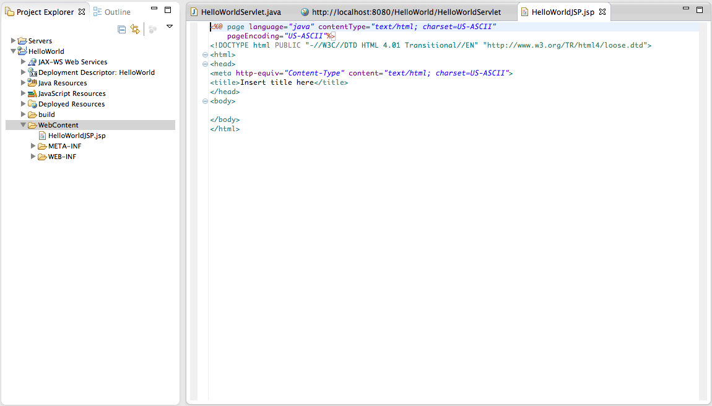
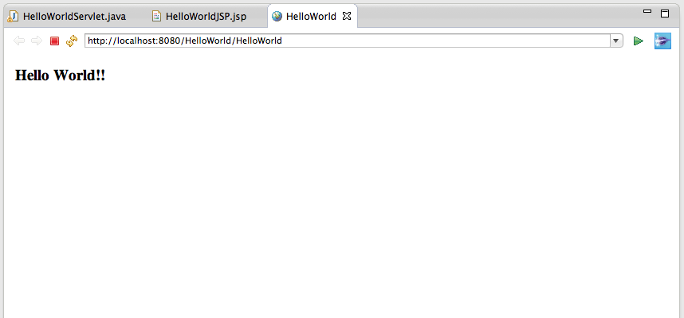

#Javaで世界に挨拶するWebアプリを作る

それでは具体的な作業に入っていきたいと思います。
まず練習として、"Hello, World"と書かれた画面を出力するWebアプリを作ってみます。
ここで行う作業は

+ サーブレットのみで挨拶
+ JSPのみで挨拶
+ サーブレットとJSPを組み合わせて挨拶

の３つです。  
これらを通して、Webアプリにふわっと触ってみましょう。

注）以下ではMac環境におけるEclipseでの作業を想定しています。Windowsの方は分からないところがあれば、適宜、師範役の人に聞いてください。

##プロジェクト作成
まずは、プロジェクトを作成します。Eclipseを立ち上げましょう。

1. プロジェクトを作成します
	+ Mac： **File > New > Other > Web > Dynamic Web Project** を選択
	+ Windows：
	
2. プロジェクト名とRuntime環境の指定
	+ **Project name** ：HelloWorld（何でも良いです）
	+ **Target runtime** ：Apache Tomcat v7.0  （選択候補になければ、 **New Runtime…** で選択してください）
	+ 他の設定は以下の図のようになっていればOKです。  
	
	
	
3. **Finish** でプロジェクトが作成されます。  
   以下のようなファイル構成のプロジェクトが作成されれば成功です。

	


##サーブレットのみで挨拶

それではサーブレットを使って世界に挨拶していきましょう。

1. サーブレットの作成
	1. ファイル構成の **Java Resources > src** を選択
	2. **src** を右クリック
	3. **New > Servlet** を選択
	4. Package名とClass名を入力
		+ **Java package** ：com.java.handson（何でも良いです）
		+ **Class name** ：HelloWorldServlet（何でも良いです）
		
		
		
	5. **Finish** で作成されれば成功
	
		

	
2. コードを追加  
   すでに、Eclipseが自動でサーブレットに必要な機能を作成してくれています。
    	
   ① マッピングされるアドレスを指定してくれています（コード上部）
  
	```
	@WebServlet("/HelloWorldServlet")
	```

   ② GET・POSTのリクエストに対応するメソッドも作ってくれています（コード中部）
     
    ```
    protected void doGet(…)
    protected void doPost(…)
    ```
	
   なので、これらにコードを加えていくだけでお好みのサーブレットを作成することができます。それではとりあえずコードを書いていきましょう。
	
   1. コード上部の **import** から始まる文の横にあるプラスマークをクリック
   2.  ```java.io.IOException;``` の下に次のコードを追加
	
       ```
	   import java.io.PrintWriter;
	   ```
		
   3.  ```protected void doGet(…``` のメソッド内に次のコードを追加
		
	   ```
	   response.setContentType("text/html; charset=UTF-8");
		　
	   PrintWriter output = response.getWriter();
	   output.println("<html>");
	   output.println("<body>");
	   output.println("<h3>Hello, World</h3>");
	   output.println("</body>");
	   output.println("</html>");
	   output.close();
	   ```	
	
3. サーブレットを実行する
	1. 左のファイル構成で、サーブレット **"HelloWorldServlet"** を右クリック
	2. **Run As > Run On Server** を選択
	3. 以下の画像のようにServerを設定
		
		
		
	4. **Finish** を押して、以下のEclipseブラウザが開かれたら成功です。
		
		
	
今、実行されたブラウザのURLアドレスは、
  
```
http://localhost:8080/HelloWorld/HelloWorldServlet
```

となっています。このURLの意味を前から説明すると、

+ ```http:/``` : HTTPプロトコルという通信のルールを使うという意味
+ ```/localhost``` : localhostというサーバ（自分のPC）にアクセス
+ ```:8080``` : ポート番号8080というポートを使う
+ ```/HelloWorld``` : さっきから作成しているプロジェクト名のHelloWorld
+ ```/HelloWorldServlet``` : さっき作成したサーブレットがマッピングされているアドレスの **/HelloWorldServlet**

のようになっています。他のブラウザ(Chrome, Safariなどなど)でアクセスしても同様の画面を表示することができます。  

ここまででだいたいのサーブレットの動きが分かったかと思います。  
ここではHTMLコードを一行一行入力していましたが、通常のサービスで用いられるHTMLコードだとこの方法はとってもめんどくさくなるのが目に見えてますね。

そこで、次ではHTMLコードをそのまま書けるJSPについて体験したいと思います。


##JSPのみで挨拶

1. JSPの作成
	1. ファイル構成の **WebContent** を選択し右クリック
	2. **New > JSP File** を選択
	4. File名を入力
		+ **File name** ：HelloWorldJSP.jsp（何でも良いです）
		
		
		
	5. **Finish** で以下のように作成されれば成功
	
		


2. JSPファイルの ```<html>``` 以下を次のように編集
   
   ```
   <html>
   <head>
   <meta http-equiv="Content-Type" content="text/html; charset=US-ASCII">
   <title>HelloWorldJSP</title>
   </head>
   <body>
   <h3>Hello World!!</h3>
   </body>
   </html>
   ```

3. 実行
   
   1. 左のファイル構成の **HelloWorldJSP** を選択して右クリック
   2. **Run As > Run on Server** を選択して、以下の画面が表示されれば成功
      

このように、JSPではHTMLを直接ファイル内に書くことができます。
また、JSP内にはJavaのコードを **<% %>** で囲むことで記述することもできます。

先ほどのサーブレットに比べると、HTMLを直接書くことについては優れていそうですが、Javaプログラムとして何らかの処理をつらつらと書いていくことについてはちょっとしんどそうな感じがしますね。

そこで、  
それぞれの良い部分をとって、重い演算などの処理はサーブレットで行い、その処理結果をJSPに渡して、  
JSPでHTMLを記述していくという実装を行うと幸せになれるかもしれないよねー  

ということで、次ではサーブレットとJSPを組み合わせて挨拶してみましょう。


##サーブレットとJSPを組み合わせて挨拶

1. 新しいサーブレットを作成する
	
	1. 先ほどのサーブレットと名前を変えて作成 ( **HelloWorld** とか)
	2. doGetメソッドの中身に以下のコードを追加
	   
	   ```
	   request.setAttribute("message", "Hello World!!");
	   　
	   RequestDispatcher disp = request.getRequestDispatcher("/HelloWorld.jsp");
	   disp.forward(request, response);
	   ```
	
2. 新しいJSPファイルを作成する
	
	1. 先ほどのJSPファイルと名前を変えて作成 ( **HelloWorld.jsp** とか)
	2. ```<title>``` タグと ```<body>``` タグの中身をそれぞれ以下のように変更する
	
	   ```
	   <title>HelloWorld</title>
	   ```
	   
	   ```
	   <body>
	   <h3>${message}</h3>
	   </body>
	   ```
	   
3. サーブレットを実行する

	1. 左のファイル構成から、今作成したサーブレットを実行する
	2. 以下のように世界に挨拶できたら成功
	
	   
	  
結果画面のURLは

```
http://localhost:8080/HelloWorld/HelloWorld
``` 

となっています。これはアドレス ```/HelloWorld/HelloWorld``` にマッピングされているサーブレットを実行していることを示します。サーブレットを実行した結果、JSPに記述したHTMLコードをブラウザは表示しているので、うまくサーブレットとJSPを組み合わせられたことが分かります。
	   
サーブレットで行っていることは、

+ ```request``` に、値が"Hello World!!"の引数 ```message``` を加える
+ ```RequestDispatcher``` を使って、その ```request``` と返信用の ```response``` を **HelloWorld.jsp** に渡す

ということをやっていて、それを受け取ったJSP側では、

+ ```request``` の引数 ```message``` を認識する（勝手にやってくれる）
+ ```${引数名}``` の形で、```message```の値にアクセスすることができる（ ```<body>``` タグ内）

ということをやって、最後のHTMLをレスポンスとしてブラウザに返しています。

こうすることによって、リクエストを受け取ってから

+ サーブレットで何らかの処理を行い
+ その処理結果を上記のような形でJSPに渡し
+ JSPでその結果を表示するHTMLを記述する

という処理の棲み分けができ、（少なくとも最初の2つよりは）拡張性や運用のしやすさにおいて優れた構成になっていることがなんとなく理解できたのではないかと思います。

---
ここまでで基本的なところは終了です。  
DBを使ったWebアプリを作りたい方は、以降のJDBCについての資料に目を通してください。  
特にDBを使わずにWebアプリを作る方は、HTMLについての付録を参考にしながら、アプリケーションの作成を始めてください。
