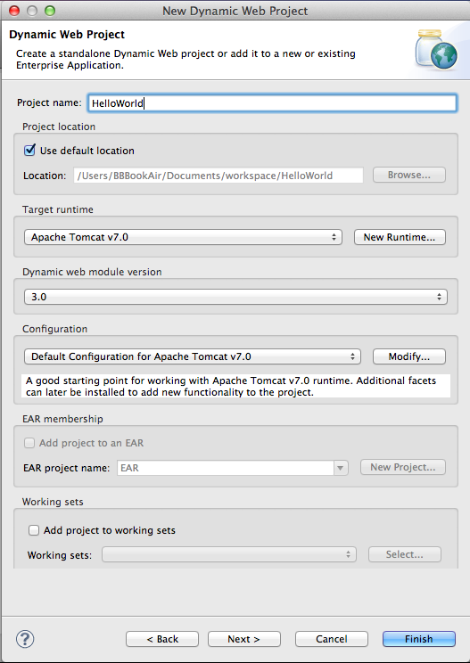
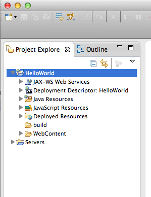
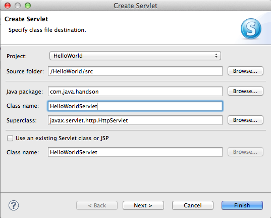
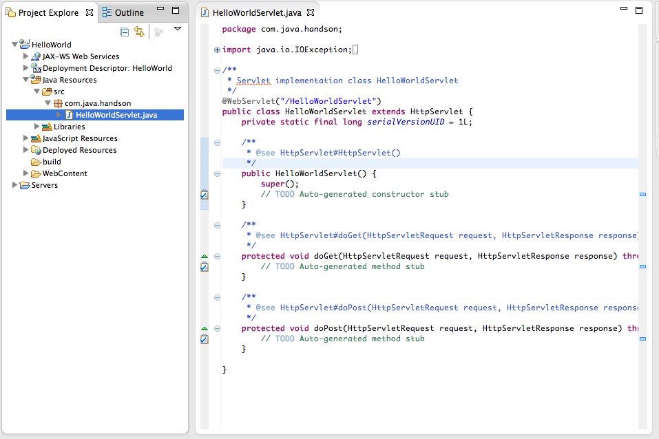
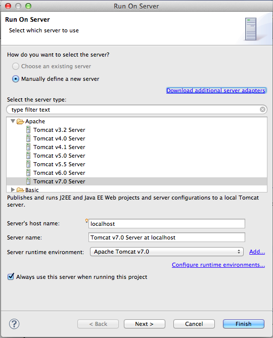
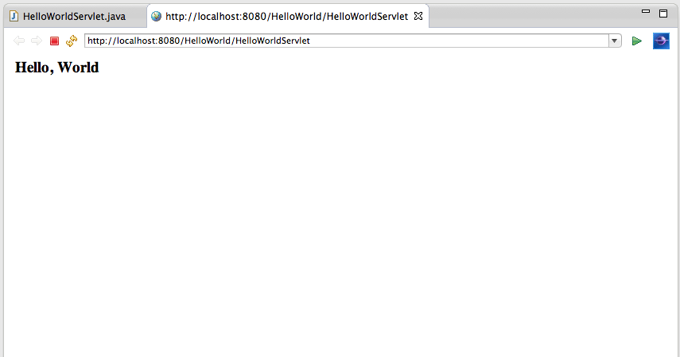

#Javaで世界に挨拶するWebアプリを作る

それでは具体的な作業に入っていきたいと思います。
まず練習として、"Hello, World"と書かれた画面を出力するWebアプリを作ってみます。
ここで行う作業は

+ サーブレットのみで挨拶
+ JSPのみで挨拶
+ サーブレットとJSPを組み合わせて挨拶

の３つです。  
これらを通して、Webアプリにふわっと触ってみましょう。

注）以下ではMac環境におけるEclipseでの作業を想定しています。Windowsの方は分からないところがあれば、適宜、師範役の人に聞いてください。

##プロジェクト作成
まずは、プロジェクトを作成します。Eclipseを立ち上げましょう。

1. プロジェクトを作成します
	+ Mac： **File > New > Other > Web > Dynamic Web Project** を選択
	+ Windows：
	
2. プロジェクト名とRuntime環境の指定
	+ **Project name** ：HelloWorld（何でも良いです）
	+ **Target runtime** ：Apache Tomcat v7.0  （選択候補になければ、 **New Runtime…** で選択してください）
	+ 他の設定は以下の図のようになっていればOKです。  
	
	
	
3. **Finish** でプロジェクトが作成されます。  
   以下のようなファイル構成のプロジェクトが作成されれば成功です。

	


##サーブレットのみで挨拶

それではサーブレットを使って世界に挨拶していきましょう。

1. サーブレットの作成
	1. ファイル構成の **Java Resources > src** を選択
	2. **src** を右クリック
	3. **New > Servlet** を選択
	4. Package名とClass名を入力
		+ **Java package** ：com.java.handson（何でも良いです）
		+ **Class name** ：HelloWorldServlet（何でも良いです）
		
		
		
	5. **Finish** で作成されれば成功
	
		

    注) ここではEclipseが自動でサーブレットに必要な機能をすでに作成してくれています。
    
    + a
	
		```
		aaa
		```
	
	我々はこれらにコードを加えていくだけでお好みのサーブレットを作成することができます。
	
2. コードを追加  
   それではGETメソッドの部分にコードを書いていきましょう。
	1. コード上部の **import** から始まる文の横にあるプラスマークをクリック
	2.  ```java.io.IOException;``` の下に次のコードを追加
	
		```
		import java.io.PrintWriter;
		```
		
	3.  ```protected void doGet(…``` のメソッド内に次のコードを追加
		
		```
		response.setContentType("text/html; charset=UTF-8");
		　
		PrintWriter output = response.getWriter();
		output.println("<html>");
		output.println("<body>");
		output.println("<h3>Hello, World</h3>");
		output.println("</body>");
		output.println("</html>");
		output.close();
		```	
	
3. サーブレットを実行する
	1. 左の **Project Explorer** からこのプロジェクト **"Hello World"** を右クリック
	2. **Run As > Run On Server** を選択
	3. 以下の画像のようにServerを設定
		
	4. **Finish** を押して、以下のEclipseブラウザが開かれたら成功です。
		
	
今、実行されたブラウザのURLアドレスは、
  
```
http://localhost:8080/HelloWorld/HelloWorldServlet
```

となっています。このURLの意味を前から説明すると、

+ ```http:/``` : HTTPプロトコルという通信のルールを使うという意味
+ ```/localhost``` : localhostというサーバ（自分のPC）にアクセス
+ ```:8080``` : ポート番号8080というポートを使う
+ ```/HelloWorld``` : さっきから作成しているプロジェクト名のHelloWorld
+ ```/HelloWorldServlet``` : さっき作成したサーブレットがマッピングされているアドレスの **/HelloWorldServlet**

のようになっています。他のブラウザ(Chrome, Safariなどなど)でアクセスしても同様の画面を表示することができます。  

また、どのようにしてこの画面が表示されているのかについては、先述のWebアプリの仕組みに沿っていくと、  

① ブラウザが上記URL（つまりは自分のPC）にアクセスする  
② すると起動しているTomcat兄さんがアクセスを感受して  
③ アドレス **/HelloWorld/HelloWorldServlet** にマッピングされているサーブレットのGETメソッドを呼び出す（デフォルトはGetメソッド）  
④ HelloWorldServletの **doGet()** メソッドが呼び出される  
⑤ メソッド内では、 **response** にHTMLコードを一行ずつ入力  
⑥ HTMLコードが入力された **response** が返信される  
⑦ ブラウザは受け取った **response** の中身を表示する。  

というようにして、ブラウザのアクセスからHello Worldの表示までがなされています。

ここまででだいたいのサーブレットの動きが分かったかと思います。  
ここではHTMLコードを一行一行入力していましたが、通常のサービスで用いられるHTMLコードだとこの方法はとってもめんどくさくなるのが目に見えてますね。

そこで、次ではHTMLコードをそのまま書けるJSPについて体験したいと思います。


##JSPのみで挨拶


##サーブレットとJSPを組み合わせて挨拶


