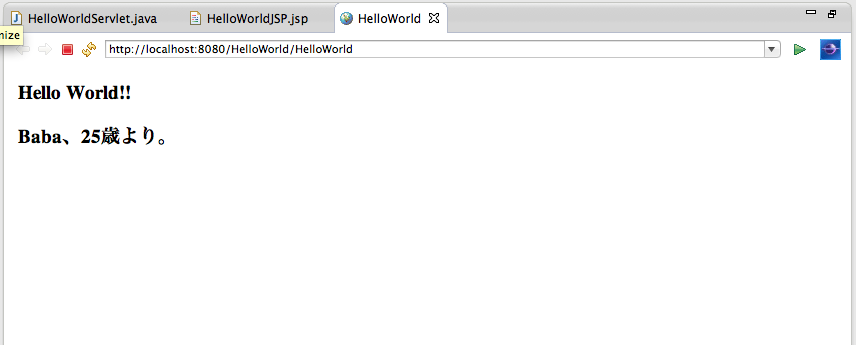

#JDBCとMySQLでDB操作

ここではJDBCとMySQLを用いてサーブレットからDBを操作する方法を説明します。

注)まだmac端末における操作しか対応できてません！すまん！

##環境設定

MySQLと、MySQLのJDBC用のコネクタのインストールについて説明します。

###MySQLのインストール

MySQLをインストールしていない人は、
以下のサイトが非常に分かりやすいので、ここを参考にインストールしてみてください。（無料のアカウント登録が必要です）

参考サイト：Mac OSへのMySQLのインストール方法（Yukun's Blog）  
http://www.yukun.info/blog/2013/03/mac-mysql-install.html

注）上記サイトの最後でのrootパスワード設定を忘れずに行っておいてください（あとで必要になります）

```
$ mysqladmin -u root password 'パスワード文字列'
```


###JDBC用コネクタ(MySQL Connector/J)のインストール

それではMySQLのJDBC用のコネクタをインストールします。

1. MySQLのConnector/Jのページ（以下のリンク）にアクセスします。  
	http://dev.mysql.com/downloads/connector/j/

2. 下の **Select Platform** のプルダウンから **Platform Independent** を選択
3. 表示されたファイルのうち、zipファイルをダウンロード
4. ダウンロードしたファイルを解凍し、中のJARファイルをTomcatのlibフォルダにコピー
	+ コピー元は、解凍したフォルダの中に入っている **mysql-connector-java-X.X.XX-bin.jar** ファイル
	+ コピー先は、 **先ほどのTomcatダウンロード時の任意の場所 / lib** 
	+ ターミナルで以下のコマンドを打つことでできます。
	   
	   ```
	   $ cp 解凍フォルダ/mysql-connector-java-X.X.XX-bin.jar
	   ```


以上で環境設定は完了です。

	   
### MySQLにDBを作成する

サーブレットでのDB操作の前準備として、データベースを作成しておきましょう。
今回は、 **sample** というデータベースに **personal** テーブルを作成します。

1. root権限でMySQLを立ち上げる
   
   ```
   $ mysql -u root -p
   ```
   
2. データベースの作成（一例）
   
   ```
   create database sample;
   use sample;
   create table personal (name char(10), old int);
   insert into personal values('Baba', 25);
   ```

3. 作成したデータベース内にあるテーブルの確認

   ```
   show tables;
   ```
   
4. **personal** テーブルのプロパティの確認

   ```
   describe personal;
   ```

5. **personal** テーブルの確認

   ```
   select * from personal;
   

以上では、 **SELECT** 文を用いて **personal** テーブルの中身を確認しています。
その他のSQL操作については以下のサイトなどを参考にしてください。

+ MySQLクイック・リファレンス  
http://www.bitscope.co.jp/tep/MySQL/quickMySQL.html

+ Qiita - SQLコマンド一覧
http://qiita.com/kenjiskywalker/items/d01f7e9f8261e24d53fa


##サーブレットからDB操作

###サーブレットでJDBCドライバを用いたDB操作

準備ができたところで早速サーブレットを編集していきたいと思います。
以下では、「世界に挨拶する」で作っていた **HelloWorld.java** を変更していきます。

1. サーブレットに新しいメソッド ```setPersonal``` を作ります。このメソッドは ```request``` に新しい引数 ```name``` と ```old``` をセットします。

   ```
   // requestにnameとoldをセットするメソッド
   // 引数: HTTPServletRequest request
   private void setPersonal(HttpServletRequest request) {
   　
		try {
		　		
			// JDBCドライバの登録
			Class.forName("com.mysql.jdbc.Driver").newInstance();
			　
			// データベースへの接続
			Connection con = DriverManager.getConnection("jdbc:mysql://127.0.0.1:3306/sample", "root", "設定したパスワード");
			　
			// SQLステートメントオブジェクトの生成
			Statement st = con.createStatement();
			　
			// SQLステートメントの発行
			ResultSet rs = st.executeQuery("select * from personal");
			　
			// SQLステートメントの結果からnameとoldを取得し、requestにセット
			while(rs.next()) {
				request.setAttribute("name", rs.getString("name"));
				request.setAttribute("old", rs.getInt("old"));
			}
			　
		} catch (SQLException e) {
			e.printStackTrace();
		} catch (InstantiationException e) {
			e.printStackTrace();
		} catch (IllegalAccessException e) {
			e.printStackTrace();
		} catch (ClassNotFoundException e) {
			e.printStackTrace();
		}
	}
   ```

2. ```doGet``` メソッド内で上のメソッドを呼出します。以下のように変更します。

   ```
   request.setAttribute("message", "Hello World!!");
   　
   // DBからrequestに引数をセットする
   setPersonal(request);
   　		
   RequestDispatcher disp = request.getRequestDispatcher("/HelloWorld.jsp");
   disp.forward(request, response);
   ```

これでLocalのDB **sample** からデータを取得することができました。次に取得してきたデータを表示するためにJSPを変更します。

###表示を変えるためのJSPの変更

ページの表示を変えるためにをJSPを編集します。
「世界に挨拶する」で作成した **HelloWorld.jsp** の ```<body>``` タグを以下のように変更します。
   
   ```
   <body>
   <h3>${message}</h3>
   <h3>${name}、${old}歳より。</h3>
   </body>
   ```
   
以上のように、サーブレットで追加した引数のnameとoldを使って、差出人を表示します。
最後にサーブレットを実行して、以下のような表示になれば成功です。




###その他の操作（JDBCからDBを操作する）について

上記の例では、 ```setPersonal``` メソッド内の

```
// SQLステートメントの発行
ResultSet rs = st.executeQuery("select * from personal");
``` 

によってMySQLの **SELECT** ステートメントを発行していまが、
MySQLのDBの操作は、 **SELECT** だけではなく、 **UPDATE** や **INSERT** 、 **DELETE** などがあります。

これらの操作については公式リファレンスがわかりやすいので、一部抜粋して紹介します。


```
Statement インスタンスを得たら、使いたい SQL で executeQuery( String) メソッドを呼び出し、SELECT クエリを実行することができます。

データベースのデータを更新するには、executeUpdate(String SQL) メソッドを使用します。
このメソッドは、update 文に影響を受けた行の数を戻します。

SQL 文が SELECT 、または UPDATE/INSERT になるかが事前に分からない場合は、
execute(String SQL) メソッドを使用することができます。
このメソッドは、SQL クエリが SELECT の場合は true 、
UPDATE 、INSERT 、もしくは DELETE 文の場合は false を返します。
ステートメントが SELECT クエリの場合は、getResultSet() メソッドを呼び出すことで結果を摘出できます。
ステートメントが UPDATE 、INSERT 、もしくは DELETE 文であれば、Statement インスタンスで getUpdateCount() を呼び出すことによって、影響を受けた行の数を呼び出すことができます。
```

MySQL 5.1 リファレンスマニュアル - 24.4.5.1 JDBC の基本コンセプト  
http://dev.mysql.com/doc/refman/5.1/ja/connector-j-usagenotes-basic.html

以上を参考にDBを操作してみてください。

---
JDBCとMySQLを用いたDB操作については以上です。

DBを自作してもいいですが、外部のデータを用いることもできます。  

+ 日本郵政 - 住所データ: http://www.post.japanpost.jp/zipcode/download.html
+ 株価データ: http://www.rain-net.com/kabu/

などなど。取得したCSVファイルをMySQLにインポートすることでDBとして扱えます。
インポートする方法については自分で調べるか、師範役に聞いてみてください。

残りの時間で、これまでの資料とJSPでの入力フォームについての付録を見つつ、Google先生に相談しながら、簡単でいいのでオリジナルのWebアプリケーションを作ってみましょう！