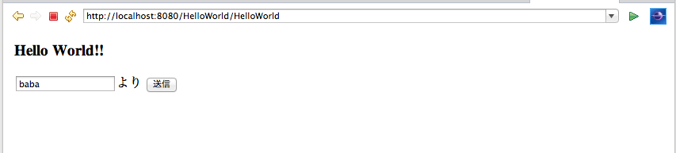
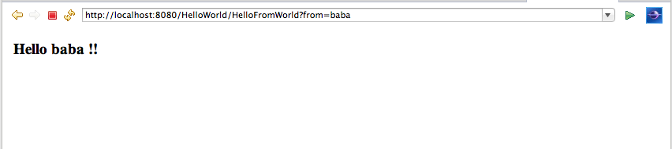

#入力フォーム

ここでは入力画面作成に用いられる入力フォームの実装とその値の取り出し方について、ひとつの例を用いて説明します。今回は差出人を入力すると、世界から返事が返ってくるアプリを作りたいと思います。

##JSPでの入力フォームの実装

3.mdで作成した **HelloWorld.jsp** に入力フォームを追加してみましょう。

1. **HelloWorld.jsp** の ```body``` タグ内を以下のように変更

   ```
   <body>
   <h3>${message}</h3>
   <form action="HelloFromWorld" method="get">
    <input type="text" name="from" />より
    <input type="submit">
   </form>
   </body>
   ```

2. **HelloFromWorld.jsp** の作成（3.mdを参考に）

3. **HelloFromWorld.jsp** の ```body``` タグ内を以下のように変更

   ```
   <body>
   <h3>Hello ${from}</h3>
   </body>
   ```

**HelloWorld.jsp** 内にある ```input``` タグの ```name``` 属性の **"from"** が、サーブレットに渡す引数の名前です。
これを ```form``` タグで指定しているサーブレット **HelloFromWorld** へリクエストを送ります。


##新しいサーブレットを用意

差出人に返事を返す動作を行うサーブレットを別に作ります。

1. **HelloFromWorld** サーブレットを作成

2. サーブレット内の ```doGet``` 内のコードを以下のように編集

   ```
   String from = (String) request.getParameter("from") + " !!";
   request.setAttribute("from", from);
	　
   RequestDispatcher disp =
   request.getRequestDispatcher("/HelloFromWorld.jsp");
   disp.forward(request, response);
   ```

3. **HelloWorld** サーブレットを実行  
   以下の1枚目の入力に対して、2枚目が出力されれば成功です。
   
   
   
   


このサーブレットではまず、 **HelloWorld.jsp** から受け取った引数 **from** を取り出し、末尾に **" !!"** をつけて、```request``` に付与します。（前半部分）  
そして、 ```RequestDispatcher``` を用いて **HelloFromWorld.jsp** に引き継ぎます。（後半部分）

最終的に、先ほど作成した **HelloFromWorld.jsp** によって、**"Hello 差出人名 !!"** が出力されることになります。このようにして入力を受け付け、それに対する処理と応答を行います。

----

HTMLのinputタグには色んなタイプがあります。

参考1: HTMLクイックリファレンス - HTMLタグリファレンス: form
http://www.htmq.com/html/form.shtml

参考2: HTMLクイックリファレンス - HTMLタグリファレンス: input  
http://www.htmq.com/html/input.shtml

どのタイプも上記の方法でやり取りすることができるので、上記サイトを参照しながら自分なりのWebアプリを作っていってください。